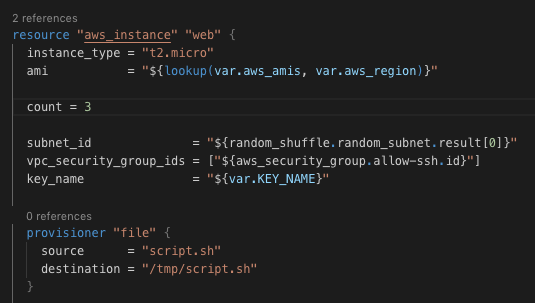

1. Execute o comando `terraform init`
2. Execute o comando `terraform apply -auto-approve`
3. Aguarde alguns minutos para que todas as maquinas estejam prontas no ELB
   
4. Quando estiverem todas prontas estarão como na imagem
   
5. Utilize o dns do ELB fornecido como saida no terraform para colar no navegador e testar o funcoinamento da Stack
   
6. Agora vá até o arquivo `main.tf` e altere o valor do count para 3
   
7. Execute novamente o comando `terraform apply -auto-approve`
   
8. Note no painel da AWS que a maquina foi criada e já colocado no ELB
   
9. Vá novamente até o arquivo `main.tf` e altere o valor do count para 1
10. Execute novamente o comando `terraform apply -auto-approve`
    
11. Dessa vez foram 2 destruições de maquina e uma alteração no ELB
    
12. Execute o comando `terraform destroy -auto-approve`